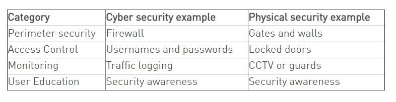

# 云原生安全概述

本概述定义了一个模型，用于在 Cloud Native 安全性上下文中考虑 Kubernetes 安全性。

> **警告：** 此容器安全模型只提供建议，而不是经过验证的信息安全策略。

## 云原生安全的 4 个 C

你可以分层去考虑安全性，云原生安全的 4 个 C 分别是云（Cloud）、集群（Cluster）、容器（Container）和代码（Code）。

> **说明：** 这种分层方法增强了[深度防护方法](# 深度防护(Defense-in-depth))在安全性方面的防御能力，该方法被广泛认为是保护软件系统的最佳实践。

[Co-Lo名词解释](# 主机托管(Co-Lo))

云原生安全模型的每一层都是基于下一个最外层，代码层受益于强大的基础安全层（云、集群、容器）。你无法通过在代码层解决安全问题来为基础层中糟糕的安全标准提供保护。

## 云

在许多方面，云（或者位于同一位置的服务器，或者是公司数据中心）是 Kubernetes 集群中的 [可信计算基](# 可信计算基(Trusted computing base))。 如果云层容易受到攻击（或者被配置成了易受攻击的方式），就不能保证在此基础之上构建的组件是安全的。 每个云提供商都会提出安全建议，以在其环境中安全地运行工作负载。

### 云提供商安全性

如果您是在您自己的硬件或者其他不同的云提供商上运行 Kubernetes 集群， 请查阅相关文档来获取最好的安全实践。

下面是一些比较流行的云提供商的安全性文档链接：

| IaaS 提供商           | 链接                                                         |
| --------------------- | ------------------------------------------------------------ |
| Alibaba Cloud         | https://www.alibabacloud.com/trust-center                    |
| Amazon Web Services   | https://aws.amazon.com/security/                             |
| Google Cloud Platform | https://cloud.google.com/security/                           |
| IBM Cloud             | https://www.ibm.com/cloud/security                           |
| Microsoft Azure       | https://docs.microsoft.com/en-us/azure/security/azure-security |
| VMWare VSphere        | https://www.vmware.com/security/hardening-guides.html        |

### 基础设施安全

关于在 Kubernetes 集群中保护你的基础设施的建议：

| Kubetnetes 基础架构关注领域       | 建议                                                         |
| --------------------------------- | ------------------------------------------------------------ |
| 通过网络访问 API 服务（控制平面） | 所有对 Kubernetes 控制平面的访问不允许在 Internet 上公开，同时应由网络访问控制列表控制，该列表包含管理集群所需的 IP 地址集。 |
| 通过网络访问 Node（节点）         | 节点应配置为**仅能**从控制平面上通过指定端口来接受（通过网络访问控制列表）连接，以及接受 NodePort 和 LoadBalancer 类型的 Kubernetes 服务连接。如果可能的话，这些节点不应完全暴露在公共互联网上。 |
| Kubernetes 访问云提供商的 API     | 每个云提供商都需要向 Kubernetes 控制平面和节点授予不同的权限集。为集群提供云提供商访问权限时，最好遵循对需要管理的资源的最小特权原则。Kops 文档提供有关 IAM 策略和角色的信息。(IAM: AWS Identity and Access Management (IAM) 是一种 Web 服务，可以帮助用户安全地控制对 AWS 资源的访问。) |
| 访问 etcd                         | 对 etcd（Kubernetes 的数据存储）的访问应仅限于控制平面。根据配置情况，你应该尝试通过 TLS 来使用 etcd。更多信息可以在 [etcd 文档](https://github.com/etcd-io/etcd/tree/master/Documentation)中找到。(TLS: 负责在传输层和应用层之间对网路进行加密) |
| etcd 加密                         | 在所有可能的情况下，最好对所有驱动器进行静态数据加密，但是由于 etcd 拥有整个集群的状态（包括机密信息），因此其磁盘更应该进行静态数据加密。 |

## 集群

保护 Kubernetes 有两个方面需要注意：

- 保护可配置的**集群组件**
- 保护在集群中运行的**应用程序**

### 集群组件

如果想要保护集群免受意外或恶意的访问，采取良好的信息管理实践，请阅读并遵循有关[保护集群](https://kubernetes.io/zh/docs/tasks/administer-cluster/securing-a-cluster/)的建议。

### 集群中的组件（您的应用）

根据您的应用程序的受攻击面，您可能需要关注安全性的特定面，比如： 如果您正在运行中的一个服务（A 服务）在其他资源链中很重要，并且所运行的另一工作负载（服务 B） 容易受到资源枯竭的攻击，则如果你不限制服务 B 的资源的话，损害服务 A 的风险就会很高。 下表列出了安全性关注的领域和建议，用以保护 Kubernetes 中运行的工作负载：

| 工作负载安全性关注领域                                  | 建议                                                         |
| ------------------------------------------------------- | ------------------------------------------------------------ |
| RBAC 授权(访问 Kubernetes API)                          | https://kubernetes.io/zh/docs/reference/access-authn-authz/rbac/ |
| 认证方式                                                | https://kubernetes.io/zh/docs/reference/access-authn-authz/controlling-access/ |
| 应用程序 Secret 管理 (并在 etcd 中对其进行静态数据加密) | https://kubernetes.io/zh/docs/concepts/configuration/secret/ https://kubernetes.io/zh/docs/tasks/administer-cluster/encrypt-data/ |
| Pod 安全策略                                            | https://kubernetes.io/zh/docs/concepts/policy/pod-security-policy/ |
| 服务质量（和集群资源管理）                              | https://kubernetes.io/zh/docs/tasks/configure-pod-container/quality-service-pod/ |
| 网络策略                                                | https://kubernetes.io/zh/docs/concepts/services-networking/network-policies/ |
| Kubernetes Ingress 的 TLS 支持                          | https://kubernetes.io/zh/docs/concepts/services-networking/ingress/#tls |

## 容器

容器安全性不在本指南的探讨范围内。下面是一些探索此主题的建议和连接：

| 容器关注领域                     | 建议                                                         |
| -------------------------------- | ------------------------------------------------------------ |
| 容器漏洞扫描和操作系统依赖安全性 | 作为镜像构建的一部分，您应该扫描您的容器里的已知漏洞。       |
| 镜像签名和执行                   | 对容器镜像进行签名，以维护对容器内容的信任。                 |
| 禁止特权用户                     | 构建容器时，请查阅文档以了解如何在具有最低操作系统特权级别的容器内部创建用户，以实现容器的目标。 |

## 代码

应用程序代码是您最能够控制的主要攻击面之一，虽然保护应用程序代码不在 Kubernetes 安全主题范围内，但以下是保护应用程序代码的建议：

### 代码安全性

| 代码关注领域              | 建议                                                         |
| ---------------- | ------------------------------------------------------------ |
| 仅通过 TLS 访问  | 如果您的代码需要通过 TCP 通信，请提前与客户端执行 TLS 握手。除少数情况外，请加密传输中的所有内容。更进一步，加密服务之间的网络流量是一个好主意。这可以通过被称为相互 LTS 或 [mTLS](https://en.wikipedia.org/wiki/Mutual_authentication) 的过程来完成，该过程对两个证书持有服务之间的通信执行双向验证。 |
| 限制通信端口范围 | 此建议可能有点不言自明，但是在任何可能的情况下，你都只应公开服务上对于通信或度量收集绝对必要的端口。 |
| 第三方依赖性安全 | 最好定期扫描应用程序的第三方库以了解已知的安全漏洞。每种编程语言都有一个自动执行此检查的工具。 |
| 静态代码分析     | 大多数语言都提供给了一种方法，来分析代码段中是否存在潜在的不安全的编码实践。只要有可能，你都应该使用自动工具执行检查，该工具可以扫描代码库以查找常见的安全错误，一些工具可以在以下连接中找到：https://owasp.org/www-community/Source_Code_Analysis_Tools |
| 动态探测攻击     | 您可以对服务运行一些自动化工具，来尝试一些众所周知的服务攻击。这些攻击包括 SQL 注入、CSRF 和 XSS。[OWASP Zed Attack](https://owasp.org/www-project-zap/) 代理工具是最受欢迎的动态分析工具之一。 |

## 知识补充

### 深度防护(Defense-in-depth)

参考: [如何理解网络安全中的纵深防御](https://www.infoq.cn/article/z0gyvfaa685qs79d3qe0)

DiD 要求将安全性应用于多个层，其工作原理是为每个层提供不同类型的保护，以便为成为阻止攻击的最佳手段。这些层也可以防止不同的问题，全方位覆盖多个不同问题。

那么，我们如何使用该策略呢?简单地说，我们将不同的安全措施分组到不同的功能类别中并应用它们。这与传统的物理安全的实现方式或分组方式没有太大区别。

### 主机托管(Co-Lo)

服务器托管是指为了提高网站的访问速度，将您的服务器及相关设备托管到具有完善机房设施、高品质网络环境、丰富带宽资源和运营经验以及可对用户的网络和设备进行实时监控的网络数据中心内，以此使系统达到安全、可靠、稳定、高效运行的目的。

### 可信计算基(Trusted computing base)

**可信计算基**（英语：Trusted computing base, TCB）是指**为实现计算机系统安全保护的所有安全保护机制的集合**，机制可以硬件、固件和软件是泄漏了系统安全策略赋予它们的相关权限而已，这些权限一般都是比较低的。

精心设计和实现的系统**可信计算基**对系统整体安全至关重要。现代操作系统努力降低TCB的大小，使得对其代码库彻底的检查成为可能（通过手工或电脑辅助软件审计或形式化验证形式化验证)的方法）。

